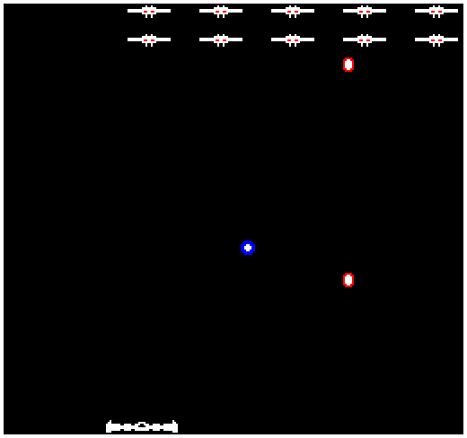

# Pongalaga

Author: Jesse Liu (jzliu@andrew.cmu.edu)

Design: It's like Pong, but the "bricks" shoot back at you. I procrastinated too hard and didn't implement several of the shoot-em-up/bullet-hell-like features I'd thought of, so it's probably not very interesting, but it's at least new to me.

Screen Shot:

How Your Asset Pipeline Works:

I drew a 256x240 png using the free editor on Pixilart (https://www.pixilart.com/draw#), and used a modified version of the magnanimous Jude Markabawi's (jmarkaba@andrew.cmu.edu) 
code shared on the Discord server to convert the image to binary files. When the game is ran, it reads those binary files to compute the background, palette table, and tile table assets. 
My drawing is included in the assets directory; I originally had separate drawings for each unique tile, but in the end I only used the 256x240 one to compute the binary files. 
[Link](assets/assets.png))

How To Play:

Use the left and right arrow keys to move the player's ship around at the bottom of the screen. Bounce the blue ball to eliminate the aliens at the top of the screen; letting the ball hit the screen bottom or getting hit by one of the aliens' shots will result in a game over. 

This game was built with [NEST](NEST.md).

